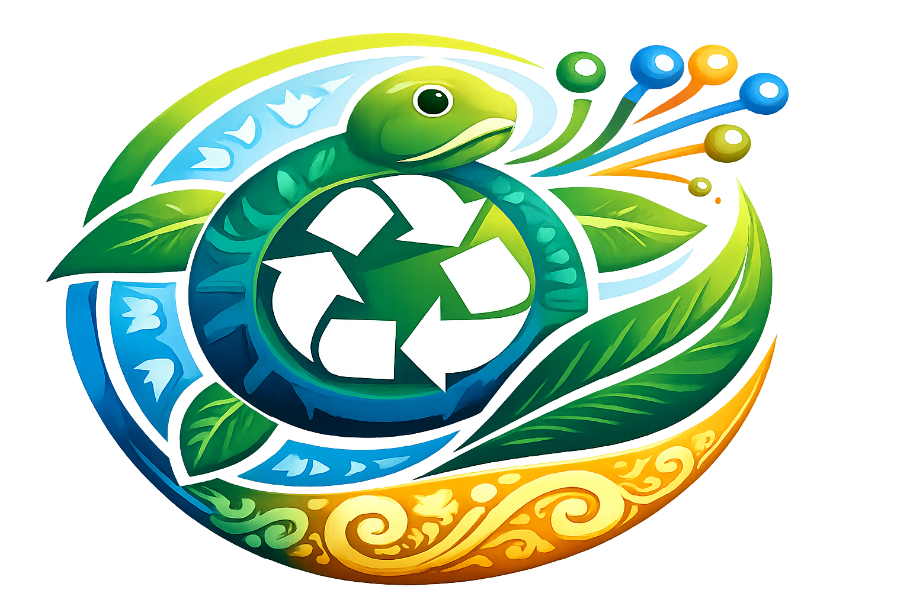

<p align="center">
  
</p>

<h1 align="center">SIDASI Backend</h1>

<p align="center">
  <strong>Sistem Digital Identifikasi Sampah (Bali)</strong><br>
  A robust Laravel-based REST API for waste identification, point rewards, and environmental data tracking.
</p>

<p align="center">
<a href="https://github.com/TudeOrangBiasa/sidasi-backend/actions"></a>


</p>

## 🌟 Key Features
- **Real-time Waste Identification**: Powered by the **Open Food Facts API** to identify product brands and material composition (PET/Plastic) from barcodes.
- **Contribute & Earn**: Secure point calculation system for user environmental contributions.
- **Auth & Security**: Sanctum-powered API authentication for secure mobile integration.
- **Bali-Specific Data Tracking**: Designed to track waste distribution trends in Bali.

## 🛠 Tech Stack
- **Framework**: [Laravel 11](https://laravel.com)
- **Database**: MySQL
- **Data Source**: [Open Food Facts](https://world.openfoodfacts.org/) - A collaborative, free and open database of food products from around the world.
- **Auth**: Laravel Sanctum

## 🚀 Getting Started
This backend is designed to run in a controlled environment (like DDEV) or deployed to a standard cPanel/Linux server.

```bash
# Clone the repository
git clone https://github.com/TudeOrangBiasa/sidasi-backend.git

# Install dependencies
composer install

# Set up environment
cp .env.example .env
php artisan key:generate

# Run migrations
php artisan migrate
```

## 🌍 Open Food Facts Integration
We are proud to use data from **Open Food Facts**. Our project helps simplify the identification of plastic waste based on commercial barcodes, contributing back to the global circular economy by facilitating better waste sorting.

## 🛡 License
This project is open-sourced software licensed under the [MIT license](https://opensource.org/licenses/MIT).
